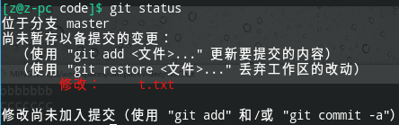
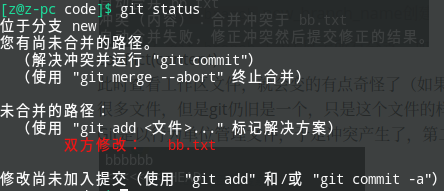

# Git使用文档

### Git基本原理

1. 哈希
   ==哈希算法==，把明文转变成密文。
   任何文件都可以作为明文通过哈希来生成密文

   ```mermaid
   graph LR
   	明文-->|hash哈希算法|密文
   ```

   有几个特点
   不管明文有多大，同一个哈希算法得到的加密结果长度固定
   哈希算法确定，只要输入明文确定，输出的密文一定不变
   只要明文变化，密文变化一定会变，且通常变化很大
   哈希算法不可逆，通过密文不可能得到明文
   Git底层采用的就是SHA-1

2. Git保存版本的机制
   先来说说svn集中式版本控制工具文件管理的机制，是以增量来存储，重复的文件不会保存，那么每一个版本的文件就是原始文件加上对应的增量
   Git分布式则是快照流，每一次提交更新Git就会对所有文件制作一个快照并保存快照的索引。如果文件没有修改的话，就不再重新存储该文件，而是保留一个链接指向之前的文件，没错，就是指针。Git是快照方式的管理文件。
   每一个变更的文件都去做一个哈希值，所有目录中的文件的哈希值和构成tree对象，这个树对象也有一个哈希值，提交对象就包括哈希值还有父对象信息，作者信息，提交者的信息，等等信息，这个提交对象也有一个哈希值！！万物皆对象，对象就是文件，文件可哈希。
   以下都有相应的哈希值
   

   ```mermaid
   graph LR
   	提交对象哈希-->树对象哈希
   	树对象哈希-->文件1哈希
   	树对象哈希-->文件2哈希
   	树对象哈希-->文件3哈希
   ```

   提交对象和其父对象形成的链条
   每一个快照都有parent，就是父节点或者说父对象，指向父对象。这就完成了GIt版本控制，A到B到C版本

3. Git管理分支

   root提交就是第一个提交，紧接这再有提交就是以这个作为父节点了
   svn分支是最傻的做法，把完整的文件和目录全部复制，这就太差了
   而Git就是新建一个指针指向这个父对象，这效率和内存就比svn高很多，分支的切换就是HEAD指针在这两个
   
   这是截取的动图


### 本地库和代码托管中心

- GitHub
- 码云

1. 团队内协作

   代码托管中心，远程库在这。首先远程库是空的，用户A把本地库A推送push到远程库，用户B把远程库clone到本地库B，用户B要push到远程库需要加入团队获得权限。而用户A想要就要拉取用户B做的改变，就是从远程库pull到本地库。

   

2. 跨团队协作

   这需要多个远程库

   

而局域网有GitLab

### 命令行操作

#### 本地库操作

  1. `git init`，先切换到工作文件夹，执行这个初始化，就会创建一个.git文件夹，里面是本地库的相关子目录和文件，不要删除，也不要胡乱修改。

  2. 设置签名：设置用户名，设置email地址，标识不同开发人员的身份。
     `git config [--global] user.name`  zyc
     `git config [--global] user.emali`  zyc@qq.com
     这个项目级别信息保存在项目文件加的.git/config文件中
     系统级别当然放在home目录下的文件中.gitconfig文件中
     辨析：这个和注册远程库的用户名邮箱是不一样的，==本地库设置的用户名和email没意义不存在都没关系的==
     但是至少有一个级别存在
     项目级别/仓库级别：仅在当前本地库范围有效，当然这个优先，如果都存在就优先。
     系统级别：这个和你操作系统登录的用户是一致的，比如我自己用的manjaro的登录用户z范围，这个级别很大

  3. `git status`查看当前仓库的状态，提交的是在本地库内，刚完成初始化本地库还是空的（no commit yet），第一次还没有commit。未跟踪文件（  nothing to commit ）未追踪文件会标记，颜色标记一般是红色

  4. `git add`  filename，将工作区的insert和update数据添加到暂存区。如果是windows就会还有LF被替换乘CRLF，这是换行符的区别，系统底层决定的
     `git add.`则是该仓库下所有变更的文件了。no commit yet。change to be commited追踪的文件就被加入暂存区，颜色标记变成绿色。

  5. `git rm --cached <filename>`就会把从暂存区移除，文件在工作区存在的！！！

  6. `git commit <filename>`就是把暂存区提交到本地库。这时候就要提示需要commit message。也就是本次提交的注释。

  7. 这会跳出[master (root-commit) number] commit message，意思是第一次提交，也就是根提交。
     1 file changed,1 insertionis(+)，create mode 100644 t.txt，这个数字是文件权限

  8. 这时候我们修改其中的文件，以t.txt为例，修改之后用`git status`查看，可以看到提示，修改modified：t.txt。会有
     `git restore`就是直接放弃掉这个修改

      对于已经追踪的当然可以使用上面已经说过的`git add`添加到暂存区，或者也可以一步到位直接使用`git commit -a`提交到本地库

  9. `git commit <filename> -m "message" `自然也可以一起的参数了 `git commot -a -m "message"`，直接提交到本地库

  10. 流程图
      

  11. 版本的后退，先讲一下日志！！
      `git log`查看整个git的全部文件版本，哈希值head -> master，这就是指针！！！回退就是这样实现的
      
  12. `git log [--pretty=oneline]`和`git log [--oneline]`日志，`git reflog`显示的日志是有指针记录。日志太多，空格翻页，b上一页，q退出！  
      
  
  13. 回退关键----指针，就是操作指针。三种方法
  
         1. 基于索引值操作，这是最值得推荐的`git reset --hard` index，这个index就是reflog的那一串数字，也就是hash值的一部分前7位，局部索引
        
         2. 使用^符号，这是只能回退的，那么就意味这只能当前版本往后退，用`git reset --hard HEAD^^`异或符号，几个符号退几步。
         3. 使用~符号 ，这就是接数字，就是后退几步,`git reset --hard HEAD~2`
  
  14. 仔细讲解关于reset参数的理解
      我们重新来理解下逻辑，我们默认初始状态是无文件要提交，干净的工作区
  
         1. 工作区就是我们个人文件夹，本地文件夹的意思。新建的文件是一定没有被追踪的。对于已经被追踪的文件，修改或者删除已经追踪的文件操作。此时查看`git status`都一定全部是红色的。
            总结就是工作区里的文件发生改变，就是红色！！！==要不就是新建文件未追踪，要不就是已经追踪的文件被修改或者删除==
            
        
         2. 暂存区或者叫索引区，需要使用`git add <filename>`命令把工作区的变更文件添加到暂存区以备提交，此时再查看状态，添加到暂存区的文件就会变成绿色！！！！
            
            `git add .`等价于`git add -A`命令就是把所有的工作区变更添加到暂存区，全部变成绿色！！！
            
      
      3. `git commit`把暂存区提交到本地库，此时的状态就是三者齐平的状态，重置就是修改的意思
           
           官方help文档如下
           
           |  参数   |                             意义                             |
           | :-----: | :----------------------------------------------------------: |
           | --hard  | Resets the index and working tree. Any changes to tracked files in the working tree since <commit>are discarded. **<u>重置索引区和工作区</u>**。自commit以来工作区的任何更改都将被丢弃。**<u>同时也本地库移动head指针</u>**，此时的状态是理想状态。<br />*结果是暂存区，工作区和仓库全部变动。* |
           | --mixed | Resets the index but not the working tree (i.e., the changed files are preserved but not marked for commit) and reports what has not been updated. This is the default action. If **-N** is specified, removed paths are marked as intent-to-add (see **git-add**(1)) .**<u>重置暂存区但是不触碰工作区，本地仓库指针移动。保留上次的提交在工作区，上次的提交不会回到暂存区</u>**。多出红色。<br />*结果是仓库和暂存区变动。* |
       | --soft  | Does not touch the index file or the working tree at all (but resets the head to <commit>, just like all modes do). This leaves all your changed files "Changes to be committed", as git status would put it.不会碰触暂存区和工作区文件。**<u>仅仅就是把本地仓库指针移动</u>**，就是取消上一步的commit操作。相**<u>对来说仓库回退一步的话，上次的提交又回到暂存区</u>**，就变成要提交的更改（Changes to be committed）多出绿色。<br />*结果是只有仓库变动* |
  
  15. 这时候，我们完完全全来理解一遍，定义有变更就是0变成1，初始状态是000
  
      分别对应工作区（workspace），暂存区（index/stage），本地仓库（Repository）2的3次方有8种，000和111就是最理想的状态。一般流程就是要不操作已经追踪的文件或者新建文件，总之工作区发生变化了，此时workspace的状态0变成1，此时的`git status`多出红字。然后`git add .`添加所有工作区的变更到暂存区以备提交，暂存区有了变更，由0变成1。`git commit`提交暂存区到本地仓库，于是仓库就变成
        接下来逆向思维或则叫相对思维来理解，此时都是111状态
      回滚hard的的操作就是，workspace和index重置，仓库head指针移动。就是111变成**000**，三个完全回滚
      
      回滚soft的操作就是，仅仅把仓库head指针移动。就是111变成**110**，多出绿色
      
      回滚mixed的操作就是，重置暂存区index，移动本地库的head指针。就是111变成**100**，多出红色
      
        既然111，000，110，100。
      
        1. 剩下的101，这就是说工作区和仓库都有变化，但是暂存区没有变！！一想，Git的逻辑就是先添加工作区的变更然后提交暂存区到本地库，暂存区没有变，怎么可能仓库变化了呢！！但是，注意了，linux下万物皆文件，这个是可以办到的，到了111之后，git rm -r --cached <filename>，把暂存区文件删掉就好了，这个就是和`git add`互逆的操作
        2. 011，经过上面的例子，我想这个也好理解了，111状态之后，把工作区文件删除掉就是了
        3. 010，其实也有可以的有的，工作区新建文件，然后追踪，也就是添加到暂存区（插一个这里撤销刚刚操作的命令`git restore --staged <filename>`取消暂存工作区变更）。然后在删除掉工作区文件即可，可以用`git ls-files`命令查暂存区文件的变化
        4. 001，看上去很离谱，工作区和暂存区都没有变化，但是仓库变化？也是可能的，工作区创建新文件，`git add`追踪，然后`git commit`提交暂存区，此时111，接着删除工作区文件，`git rm -r --cached <filename>`，这就完成了！！！
      
        总结其实2的3次方，八种都是可以实现的，要理解Git是三种状态，很多人不理解暂存区提交到了本地仓库为什么暂存区还会有文件，其是把暂存区理解成一个暂时仓库就好了
        workspace，index，Repository是三个都有本件存在的地方，我们的理想状态就是三者同步平齐！！
  
  16. 注意值得说一下，指针只有本地仓库的head指针，其参数也是依据这个的，不管是工作区还是暂存区。
  
      下面说几个经典场景例子：
  
      1. 删除工作区文件，添加到暂存区，已经提交到仓库去了
         删除工作区文件的话，`git status`查看是
         有的`restore`是`checkout`，相同的意义 。
         使用`git add <filename>`或者 `git rm <filename>`添加到暂存区！！然后`commit`提交，本地库是通过提交实现版本记录，在git中仓库中的版本是只会增加的，提交的记录不会磨灭的（正常的流程），除非删除本本库，或者变基，`git rabase`命令，这个非常灵活爷非常危险
         我们可以通过回滚到这一版本实现文件的在工作区的找回。`git reset --hard HEAD^`（这里是指一步操作，直接用HEAD^，就是要指向到存在这个被删除文件的指针位置。）
      2. 删除工作区文件，添加到暂存区了，还没有提交到本地仓库 
         使用`git restore --staged <filename>`，有的是`git reset HEAD <filename> `。这一步就是把这个移除暂存区刚刚添加进来的，然后在用`git restore`丢弃工作区的改动。两步操作。
         或者直接依据本地库回滚`git reset --hard HEAD`一步到位。
      3. 总结：只要被删除的文件存在的版本记录被提交到了本地库，就可以通过`git reset --hard [指针位置]` 就可以恢复文件到工作区！！！
  
  17. 比较文件差异的命令`git diff`
  
      工作区文件的变更没有添加到暂存区，直接用这个命令进行比较，**<u>有区别。</u>**-+代表删除和增加，以行为单位管理。
      如果添加到暂存区的话，那么此时再次比较就没有区别了。**<u>不加参数就是默认和暂存区比较！！！！</u>** `git diff <本地库的历史版本局部索引> <filename>`可以添加参数指针就可以看到差异了，不加文件名就是所有文件的差异。例如，`git diff HEAD`，那么是和本地库的当前版本进行比较，**<u>又可以看到区别了！！因为我们现在的暂存区已经添加了工作区的更改了</u>**
  
  18. 分支branch

分支是并行推进多个功能同时开发。分支之间是相互独立的，分支也是可以合并的

  1. `git branch` 来创建分支。 而master是默认存在主线分支
     `git branch` new_branch_name创建名为new_branch_name的新分支
  2. `git branch [-v]`显示所有分支，加-v参数，显示哈希值（局部索引）和主题（message）
  3. `git checkout`切换分支
     `git checkout` new_branch_name，切 换到这个分支
  4. `git`在新的分支上加入了更改，此时的新分支领先master版本，此时合并新更改到master上 
     合并分支的操作
     1. 既然要合并，那么就当然要切换到被合并的旧分支上（切换到接受修改的分支 ）`git checkout`命令切换到要被合并的分支
     2. 执行`git merge` new_branch_name命令来合并分支，这样新分支的变更就融入了master分支
  5. 分支之间产生冲突。也就是在两个分支上都对同一文件同一行做了不同的修改并且都完整的提交了记录到本地仓库
     比如mater分支上对于branch.txt操作，然后添加，再提交到仓库。在新分支上也这样做，只是操作的内容不一致。
     1.  这两个分支合并的时候，`git merge master`会产生这样的提示
        
        conflict(content)
        
     2. 此时查看工作区文件，就会变的有点奇怪了（如果是集中式svn的话，产生冲突的时候就会产生很多文件，但是git仍旧是一个，只是这个文件的样子奇怪
        Git是以行为单位管理文件，于是冲突产生了，第二行
        
        Git用`<<<<<<<`，`=======`，`>>>>>>>`标记出不同分支的内容
        HEAD是当前指针，master则是指的master分支指针
        ​            这就是当前分支的
        ​
        ​            这就是master分支的
        ​         3. 于是我们就需要协商一下，到底如何处理这个文件
        ​            我们处理好文件，也就是把把这个文件修改成我们想要的样子，再看`git status`
        ​             于是我们执行`git add bb.txt`，再次查看状态就是
        ​            
        ​            这里接下来的提交不可以带有文件名。
        ​            （否则就是报错
        ​            ）
        ​            直接使用`git commit`命令就完成了合并
        ​            `git branch -v`查看哈希值是一模一样的

#### 远程库操作

1. 注册github
   github注册或者码云注册，用阿里云邮箱，163有时候收不到
   远程仓库的名字可以不和本地仓库一样，但是为了好识别尽量一样容易识别！！
   
   创建远程库名字，公共和私人，现在github私人也免费了
   .gitignore，忽略文件，license，许可证，有需求就选
   使用自述文件README.md初始化这个远程库，可选可不选
创建完毕后远程就有了一个空仓库
   
2. `git remote`添加别名
   有https和ssh两种，先说https的
   那么每次对应的就是形如https://github.com/username/reponame.git，类似这样的URL，但是每次都不想要打这么多，git是可以帮我们记住这些信息的，`git remote <别名> <实际地址>`命令
   `git remote add origin https://github.com/username/repo.git`意思就是添加一个别名为origin的https://github.com/username/repo.git的地址
   操作完成是这样的
   

3. 推送到远程仓库

   `git push origin master`意思就是推送到origin，推送内容是本地仓库的master分支
   

4. 从远程库克隆
   当然是要在另外一个新目录下，执行`git clone ` https://github.com/aizhouyi/code.git
   那么就是从远程库克隆到本地，这个克隆下来的其实已经完成了三点：
   
   1. 完整的下载远程库到本地
   2. 完成了本地库的初始化
      
   3. 创建了远程录的别名，也就是在这个本地库也有着别名origin
      
   
5. 加入团队获得push权限
   当然如果是在新的队员下的本地库有一个提交，直接push到远程库是==403==错误！！！！
   因为没有获得创建这个远程库的人的同意，其实就是写入这个远程库权限
需要队长邀请你，点击Settings的Collabortors，输入被邀请的用户名，然后被邀请要求就会发到你的邮箱，接受就好了。
   `git push origin master`成功
   
6. `git pull`
   pull = fetch + merge
   git fetch [远程库的别名] [远程库分支名]
   git merge [远程库的别名/远程库分支名]
   此时的远程库已经被其他合作者push了，但是队长的本地库仍旧落后版本，需要==拉取==pull到本地仓库，分解为两步：
   fetch和merge。
   `git fetch origin master`，读是不需要密码的
   fetch是先抓取，但是此时的工作区文件仍旧是没有变化的。
   `git checkout origin/master`，实际上是切换指针，这时工作区文件就变了，我们可以在这里看这个究竟改变了什么，再来考虑merge
   再次切换回本地的master分支
   `git checkout master`
   `git merger origin/master`合并这个内容，正式完成这次拉取！！

7. 同样的如果两个人对远程仓库同一个分支push的话，那么就会发生文件冲突
   此时都提交到了各自的本地仓库，都认为很重要，谁先push谁可以成功，可以推送到远程仓库，后面的就无法push。比如队长先推送，后面的推送就无法实现了
   
   `git pull origin master`拉取远程库，实际上分解动作，merge冲突和本地库两个分支合并冲突的场景和内容都是一模一样的，提示自动合并失败。手动合并一下。提交本地库然后就可以推送了
   总结：
   如果不是基于远程库的最新版所做的修改，也就是说如果本地库的上一个版本不是远程库的最新版本，那么就不能推送，因为别人做了远程库的推送，更新了远程库，导致版本已经变化，我们说了git管理文件就像链条一样，必须要有一个父对象，如果你非要push的话，简单，儿子分家呗，那就是分支的实现功能了
   解决推送相同的分支上的冲突，只能先pull拉取别人的做的推送，看看冲突在哪里，然后手动解决冲突，再推送即可
   
8. SSH登录

   1. `ls -al ~/.ssh`查看是否现有SSH密钥

   2. `ssh-keygen -t rsa -b 4096 -C "your_email@example.com"`生成全新的SSH密钥，-t选择加密算法rsa，-b bits，4096位，-C 注释说明，不是必须的，一般用邮箱
      输入密钥的路径和文件名，输入ssh的密钥密码，这个密码可以为空

   3. `ssh-keygen -p`，修改这个ssh的私匙，这个不需要可以跳过，直接到下一步

   4. 将新的ssh密钥添加到ssh-agent管理（这个设置了.ssh/config文件可以跳过，直接下一步）
      `eval "$(ssh-agent -s)"`意为后台启动ssh代理，或者`ssh-agent bash`
      `ssh-add ~/.ssh/id_rsa`意为将ssh私钥添加到ssh-agent。这个文件名称对应着刚生成的私钥文件
      `ssh-add -l`查看所有的已经添加的私钥

      ```shell
      ssh-agent -k # 杀死ssh-agent进程
      ssh-agent -s # 生成Bourne shell 风格的命令输出
      ssh-agent bash 和 `eval "$(ssh-agent -s)"`一样的
      ssh-add 语法
ssh-add [-cDdLlXx] [-t life] [file ...]
      ssh-add -s pkcs11
ssh-add -e pkcs11
      选项
      -D：删除ssh-agent中的所有密钥.
   -d：从ssh-agent中的删除密钥
      -e pkcs11：删除PKCS#11共享库pkcs1提供的钥匙。
   -s pkcs11：添加PKCS#11共享库pkcs1提供的钥匙。
      -L：显示ssh-agent中的公钥
      -l：显示ssh-agent中的密钥
      -t life：对加载的密钥设置超时时间，超时ssh-agent将自动卸载密钥
      -X：对ssh-agent进行解锁
      -x：对ssh-agent进行加锁
      ```
      
   5. 将公钥添加到github
      使用`xclip -sel clip < ~/.ssh/id_rsa.pub`复制这个公钥到剪贴板，然后添加即可
   
   6. `ssh -T git@github`测试
      这里我们想如果多个github帐号，每个帐号又是多个仓库。帐号之间又有push，pull request等要求写的时候，我们应该怎希望么样设置ssh？
      我们自然想到，把ssh公钥要到另外一个github帐号上设置一下不就可以了？
      是的，一般在主机之间是可以的，但是github把ssh公钥是放在一个池子中的，也就是说一个公钥只能放在一个github帐号上，于是我们就需要设置不同的ssh密钥
      但是问题又来了，把ssh密钥交给ssh-agent来管理，不能每次都要手动加载执行这两条命令？有很多解决办法
      ==这里我们通过设置.ssh/config文件来实现==，形如下面这样
   
      ```shell
      # Default GitHub
      Host user1
      HostName github.com
      User git
      IdentityFile ~/.ssh/id_rsa
      
      Host user2
      HostName github.com
      User git
      IdentityFile ~/.ssh/id_rsa_for_user2
      ```
   
      这是我自己机器上的
      
      ```shell
      # Default GitHub
      Host aizhouyi
      HostName github.com
      User git
      IdentityFile ~/.ssh/id_rsa
      
      Host THPHOENIX
      HostName github.com
      User git
      IdentityFile ~/.ssh/outlook_rsa
      ```
   
      `ssh -T User@HostName`相应的ssh配置文件，由Host控制
      `ssh -T aizhouyi`命令测试，读取Host名为aizhouyi配置文件，用的身份文件是~/.ssh/id_rsa
      
      这样完成了自动切换哦，当然，这样相应的也需要改写remote中的url
      形如`User1:User1Name/repositorieName1.git`
      `aizhouyi:aizhouyi/hhh.git`实际上就是`git@github.com:aizhouyi/hhh.git`这样就完成了由你定义的配置文件自动去切换配置文件
   
   7. 再次深入剖析，ssh公钥只能放在一个github用户上，否则显示Key is already in use
      于是对于不同的github，要生成各自的公钥私匙对
      私匙我们可以放心交给其他人用的话，那么就是这里我们需要辨析一下贡献者和合作者
      这也是在我们模拟多对ssh密匙的时候得出的结论，首先明确一点，github上的所有公钥是放在一起的，是一个池子，不可以多个github账户使用一个公钥，但是我们的私匙却可以不那么严格，毕竟，我们的私匙是完完全全掌握在我们自己的手上，有了私匙就可以完全获得读写这个github账户下的仓库文件的权限。也就是能够获得这个ssh私匙的==要不就是本机，要不就是本机给其他机的==
      先说本机的，这里也是多种情况的，例如贡献者，这就是，比如本人在工作的时候，其他人过来给了一点灵感，唉，这时候提交的commited也可以写他（这其实是通过提交的邮箱来认证的），这就叫做贡献者，**<u>贡献者不一定是合作者</u>**
      其他机器的，能够获得这个的，要不就是经过本人机器给别人的，~~要不就是泄露，这种不正常的情况我们不讨论~~，这种人就叫做合作者，我们给了ssh私匙那就意味之前我们想要邀请他，于是给他ssh私匙，这是正确的逻辑！！！==不是因为获得了ssh私匙，才邀请其成为合作者，而是先使其成为合作者，再给ssh私匙方便他免密登录==**<u>合作者一定是贡献者，要不我要你合作干啥？？</u>**（当然这时候也有可能会假冒邮箱伪装成其他人，于是就有了更近一步的GPG签名提交验证邮箱，三个邮箱必须一致才能签名验证通过，~~这是考虑到尽可能多的情况，哪里会有人假冒别人提交代码~~）
      两个人两个账户我们来讨论：
      这时候觉得考虑完全了，不，有人会说，其他合作者为什么不自己生成一套ssh密钥来使用呢？
      当然是不可以了！！！虽然是理论上可行，但是正反两方面想：正面想，合作者他这套用在自己的账户上了，如何用在我的账户上呢？？？有人又会说，再次生成一套不就可以了。。这总共生成至少三套ssh密匙对，复杂程度大大提高了。同时反过来想，要登录我的帐号来添加他的ssh公钥，那把我的私匙给他用也是一样的道理，这样还减少了工作量，这就是两套私匙完成的操作，只是这时候的私匙反而需要交出去了。再次说一遍，合作者一定是贡献者
      使用两台机器，两个github帐号来来模拟合作的情况就比较清晰，之前在同一个电脑上操作一下脑子混乱了


也就是注册github时候的username，其实设置成一样就一定没有问题

8. GPG签名
1. `gpg --list-secret-keys --keyid-format LONG`来查看本机，格式是LONG
   2. 没有就需要生成全新的gpg密钥
   使用`gpg --full-generate-key`来生成，接下来的选择加密方式，位长度选择，密钥的有效期限，确认生成。接着输入信息来构建用户标识来确认密钥，包括有姓名，邮箱（这个邮箱必须和github上经过验证的一样），注释，最后确定。
   3. 接下来是这一步是选择是否输入密码来保护这个密钥，该密码可以为空。到这里完整的gpg密钥生成完毕
   4. 然后就是添加gpg公钥去github账户上，账户的安全选项里去找到GPG，添加即可
   5. 然后我们需要告诉git我们需要启用gpg，并且要告诉其gpg的key id
   `git config commit.gpgSign True`
   `git config user.signingKey` key_id
   6. 最后提一句，一个gpg密钥文件是可以关联多个经过github账户验证的邮件的
   于是在commit到本地库的时候，根据user.email和gpg的邮箱，github经过验证的邮箱，这三个邮箱必须一致才可以得到验证通过，得到一个绿色的V，证明这一定就是作者本人